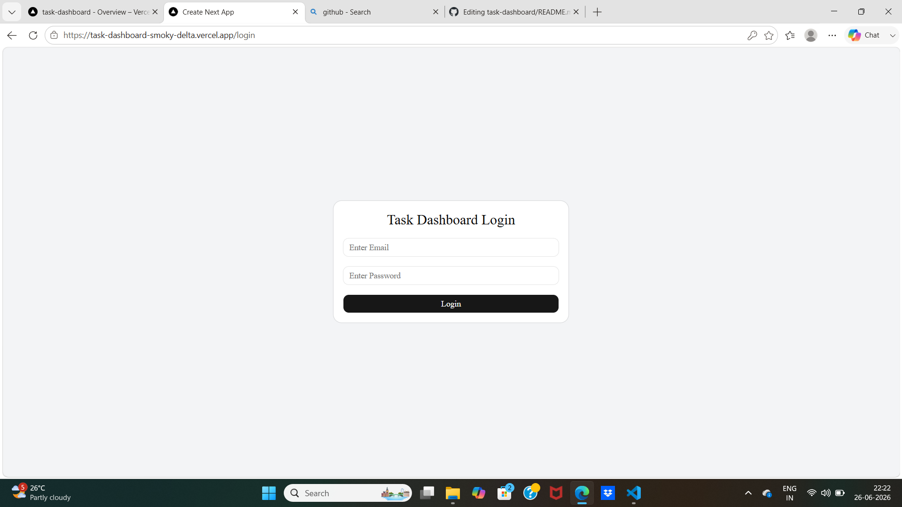
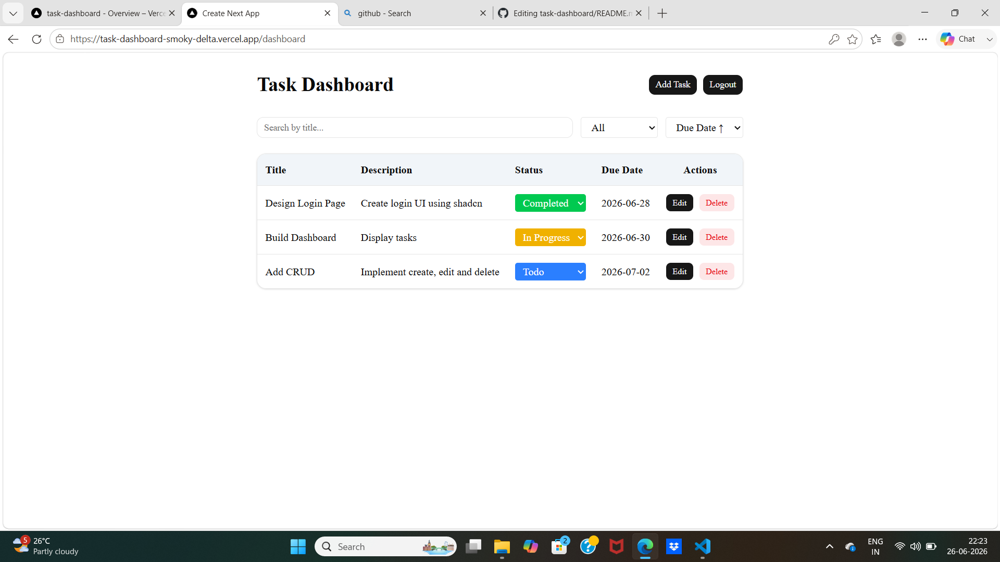
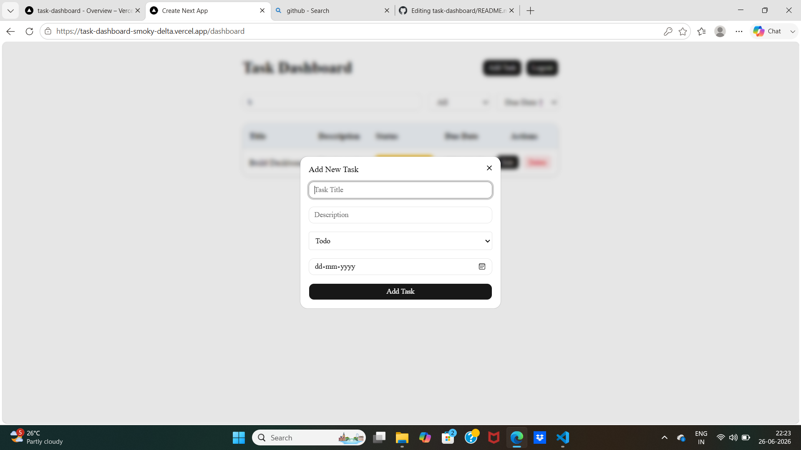
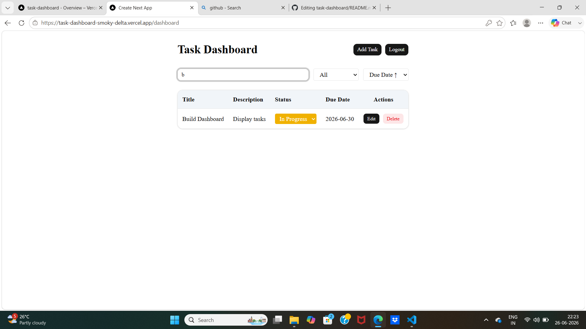
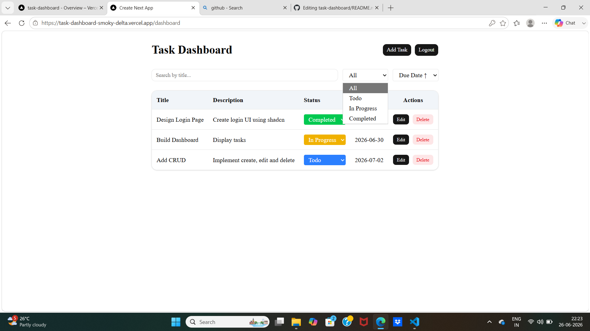
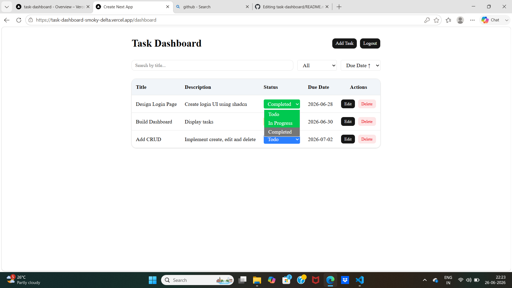

# 📋 Task Dashboard

A modern Task Management Dashboard built with **Next.js**, **TypeScript**, **Tailwind CSS**, and **shadcn/ui**.

This application allows users to log in, manage tasks, search, filter, sort, edit, delete, and update task status. All task data is stored in the browser using **Local Storage**, so data persists even after refreshing the page.

---

## 🌐 Live Demo

🔗 https://task-dashboard-smoky-delta.vercel.app/

---

## 🚀 Features

- 🔐 Simple Login Authentication
- ➕ Add New Tasks
- ✏️ Edit Existing Tasks
- ❌ Delete Tasks
- 🔄 Change Task Status
- 🔍 Search Tasks by Title
- 🎯 Filter Tasks by Status
- 📅 Sort Tasks by Due Date
- 💾 Local Storage Persistence
- 📱 Responsive Design
- 🎨 Color-coded Task Status

---

## 🛠️ Tech Stack

- Next.js (App Router)
- React
- TypeScript
- Tailwind CSS
- shadcn/ui
- Local Storage

---

## 📂 Project Structure

```
task-dashboard/
│
├── app/
│   ├── dashboard/
│   ├── login/
│   └── page.tsx
│
├── components/
│   ├── TaskDialog.tsx
│   ├── TaskTable.tsx
│   └── ui/
│
├── data/
│   └── task.ts
│
├── types/
│   └── task.ts
│
├── lib/
│   └── utils.ts
│
├── public/
│
└── README.md
```

---

## 📸 Screenshots

### Login Page



---

### Dashboard



---

### Add Task Dialog



---

### Search Tasks



---

### Filter Tasks



---

### Status Update



---

## ⚙️ Installation

Clone the repository

```bash
git clone https://github.com/YOUR_USERNAME/task-dashboard.git
```

Move into the project

```bash
cd task-dashboard
```

Install dependencies

```bash
npm install
```

Run the development server

```bash
npm run dev
```

Open your browser

```
http://localhost:3000
```

---

## 📌 Dummy Login

Use any email and password to log in.

Example

Email

```
admin@example.com
```

Password

```
123456
```

*(Authentication is simulated using Local Storage.)*

---

## 📋 Task Status

Tasks can have one of the following statuses:

- Todo 🔵
- In Progress 🟡
- Completed 🟢

The status can be updated directly from the dashboard.

---

## 💾 Data Storage

This project uses **Local Storage**.

- Login state is stored locally.
- Tasks remain available after refreshing the browser.
- Data is cleared only if Local Storage is cleared.

---

## ✨ Future Improvements

- Backend API Integration
- Database Support (MongoDB)
- JWT Authentication
- User Registration
- Drag & Drop Tasks
- Dark Mode
- Pagination
- Toast Notifications
- Due Date Reminders

---

## 👩‍💻 Author

**Aysha Minsha**

Bachelor of Science in Computer Science

MERN Stack Developer

GitHub: https://github.com/Minshaa

LinkedIn: https://linkedin.com/in/aysha-minsha-p

---

## 📄 License

This project is developed for learning and portfolio purposes.

MIT License
